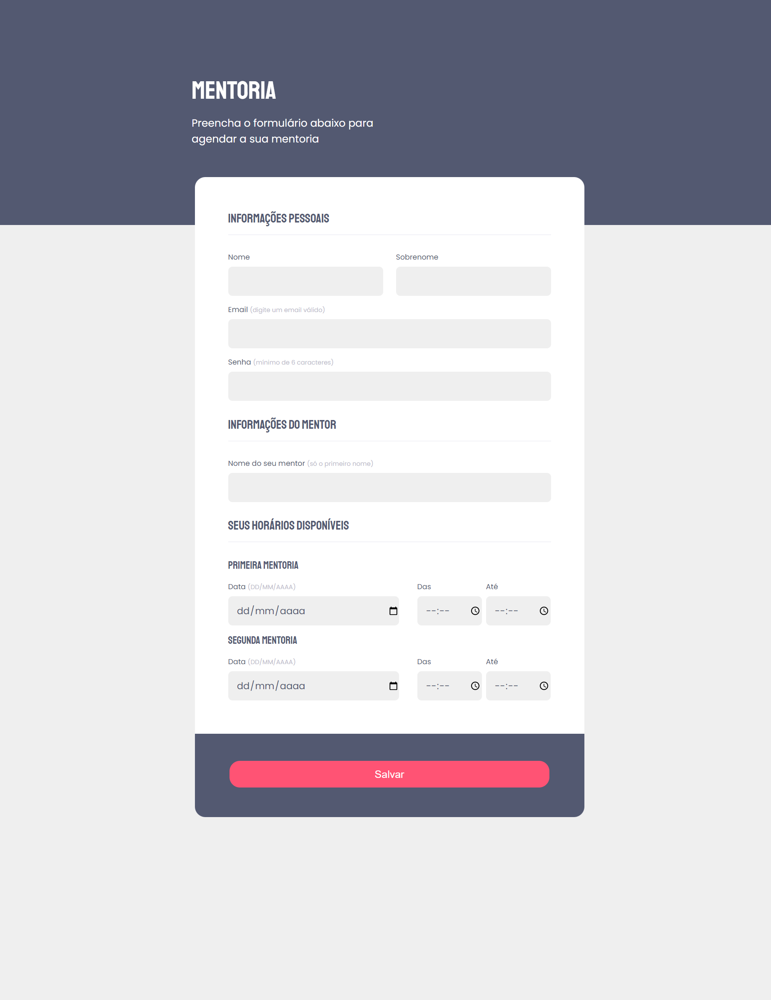

# Projeto 03

Projeto feito para recriar um site com um formulário a partir de um layout do Figma, pra treinar conceitos de html e css vistos em uma aula da Rocketseat.  
Site responsivo.

## Tecnologias
- HTML  
- CSS

## Layout
Você pode visualizar o layout do projeto através [desse link](<https://www.figma.com/file/Nws1KWB7DyXBw8L6wXb9mp/Stage-03---Formul%C3%A1rio-intermedi%C3%A1rio/duplicate?type=design&node-id=0-1>).  
É necessário ter uma conta no [Figma](https://www.figma.com).
 

  

